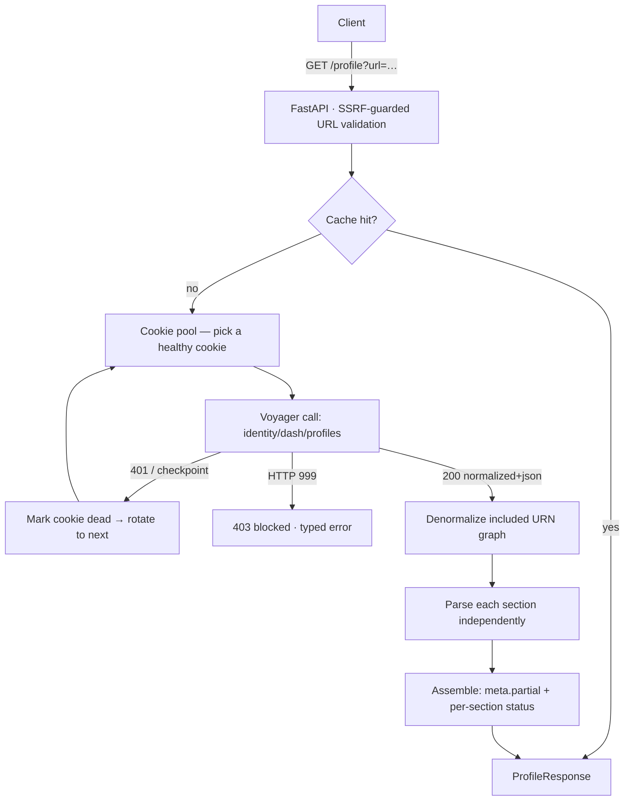

# LinkedIn Profile API

A hosted HTTPS API that takes a **LinkedIn profile URL** and returns the profile as
**structured JSON** — name, headline, location, about, experience, education, skills,
certifications, languages, and images — by calling LinkedIn's internal **Voyager API**
directly. **No browser, no Selenium/Playwright**: purely reverse-engineered HTTP.

```
GET /profile?url=https://www.linkedin.com/in/williamhgates/
```

## 🔗 Live demo

Deployed on Railway: **https://linkedin-profile-api-production-897a.up.railway.app**

| Endpoint | What it does |
|---|---|
| [`/docs`](https://linkedin-profile-api-production-897a.up.railway.app/docs) | Interactive Swagger UI |
| [`/demo`](https://linkedin-profile-api-production-897a.up.railway.app/demo) | Parsed **synthetic** sample (works with no cookie) |
| [`/health`](https://linkedin-profile-api-production-897a.up.railway.app/health) | Liveness + version |
| [`/session/status`](https://linkedin-profile-api-production-897a.up.railway.app/session/status) | Cookie-pool health (`{alive, total, dead}`) |
| `/profile?url=…` | Live scrape of a real profile (uses the server's session pool) |
| `POST /admin/session` | Hot-swap a fresh cookie at runtime (`X-API-Key`) |

```bash
curl "https://linkedin-profile-api-production-897a.up.railway.app/profile?url=https://www.linkedin.com/in/williamhgates/"
# → { "profile": { "full_name": "Bill Gates", "headline": "Chair, Gates Foundation …",
#     "location": {"text": "Seattle, Washington, United States"}, "experience": [ … ], … } }
```

> **Status:** working end-to-end against live LinkedIn via the **Dash** endpoint
> (`identity/dash/profiles`), verified on a real capture. The legacy REST `profileView`
> endpoint is now **`410 Gone`**. Core fields — name, headline, location, about, industry,
> experience (two-level company→roles), education, and images — parse from a single call;
> skills / certifications / languages / contact info come from additional profile cards
> (in progress). See [Known limitations](#known-limitations).

---

## Why this is built the way it is

Most "LinkedIn scraper" solutions either drive a headless browser (disallowed here) or
wrap an off-the-shelf library that hits LinkedIn's **deprecated** REST endpoints and does
no reverse-engineering of its own. This project instead:

- **Speaks Voyager directly** — the same internal API the linkedin.com web app calls —
  authenticated with a session cookie and the exact header set the web client sends.
- **Targets the current GraphQL/Dash surface**, not just the legacy REST endpoints, with
  `queryId`s verified from live traffic capture (documented, not guessed).
- **Denormalizes LinkedIn's Rest.li decorated responses** (the `included[]` URN graph)
  rather than trusting a library's pre-flattened output — which is what actually recovers
  nested companies, schools, logos, and media.
- **Is engineered for the block**: typed error taxonomy (HTTP 999, checkpoints, dead
  cookies), backoff + jitter, request pacing, an optional outbound proxy, caching, and
  graceful **partial results** with per-section status.
- **Is verifiable**: the parser is unit-tested against saved fixtures, so correctness can
  be checked with no network and no cookie.

The full teardown lives in [`REVERSE_ENGINEERING.md`](REVERSE_ENGINEERING.md).

## Architecture

```
app/
├── main.py              FastAPI app: /health, /session/status, /admin/session, /demo, /profile, /docs
├── config.py            env-driven settings (cookies stay in the environment)
├── session.py           cookie pool: health tracking + auto-rotation + runtime refresh
├── errors.py            typed error taxonomy -> HTTP status mapping
├── schemas.py           versioned Pydantic response contract
├── service.py           orchestration: fetch plan, cookie rotation, cache, partial results
├── cache.py             pluggable async TTL cache
└── linkedin/
    ├── client.py        Voyager HTTP client: auth, headers, CSRF, pacing, retries
    ├── endpoints.py     endpoint registry + Rest.li variable encoding
    ├── decode.py        included[]/URN denormalizer
    ├── parser.py        raw Voyager payload -> Profile (shape-stable helpers + sections)
    ├── ratelimit.py     async token-bucket limiter
    └── urls.py          profile-URL validation + SSRF guard
```



**Request flow:** validate URL (SSRF guard) → pick a healthy cookie from the pool → cache
lookup → Voyager fetch (on `401`/checkpoint, mark that cookie dead and **rotate** to the
next) → denormalize + parse each section independently → assemble typed response with
`meta.partial` + per-section status → cache → return.

## Quickstart (local)

Requires Python 3.10+.

```bash
python -m venv .venv && source .venv/bin/activate
pip install -r requirements.txt

cp .env.example .env
# Fill LINKEDIN_LI_AT and LINKEDIN_JSESSIONID — see docs/CAPTURE_RECIPE.md

uvicorn app.main:app --reload
# open http://127.0.0.1:8000/docs
```

## Configuration

All configuration is via environment variables (or a local `.env`). **No secret is ever
committed** — `.env` is git-ignored.

| Variable | Required | Default | Purpose |
|---|---|---|---|
| `LINKEDIN_LI_AT` | yes* | — | LinkedIn auth cookie (*or supply a pool via `LINKEDIN_COOKIES`) |
| `LINKEDIN_JSESSIONID` | yes* | — | Session cookie; CSRF token is derived from it |
| `LINKEDIN_COOKIES` | no | — | JSON array of `{li_at, jsessionid}` — a cookie **pool** for auto-rotation |
| `OUTBOUND_PROXY_URL` | no | — | Residential/mobile proxy for production egress |
| `API_KEY` | no | — | If set, clients must send `X-API-Key` |
| `LINKEDIN_MAX_RPM` | no | `8` | Requests/min budget toward LinkedIn |
| `CACHE_TTL_SECONDS` | no | `3600` | Per-profile cache TTL (0 disables) |
| `CORS_ORIGINS` | no | `*` | Comma-separated allowed origins |
| `LOG_LEVEL` | no | `INFO` | Log verbosity |

## API reference

### `GET /profile`
| Param | Type | Notes |
|---|---|---|
| `url` | string (required) | A `linkedin.com/in/<id>` profile URL |
| `include_raw` | bool | Include the raw Voyager payload for verification |

Returns a `ProfileResponse`:

```jsonc
{
  "meta": {
    "schema_version": "1.0",
    "source_url": "https://www.linkedin.com/in/williamhgates/",
    "fetched_at": "2026-08-31T12:00:00+00:00",
    "cached": false,
    "partial": true,                 // true while skills/certs/languages are unfetched cards
    "elapsed_ms": 476,
    "sections": [                     // per-section status — the response never overstates what it fetched
      { "section": "basics",         "ok": true  },
      { "section": "experience",     "ok": true  },
      { "section": "education",      "ok": true  },
      { "section": "skills",         "ok": false, "error": "not_fetched: served by a separate profile card" },
      { "section": "certifications", "ok": false, "error": "not_fetched: served by a separate profile card" },
      { "section": "languages",      "ok": false, "error": "not_fetched: served by a separate profile card" }
    ]
  },
  "profile": {
    "full_name": "…", "headline": "…", "location": { "text": "…" }, "about": "…",
    "experience": [ … ], "education": [ … ],
    "skills": [], "certifications": [], "languages": [],
    "profile_picture": { "url": "…", "artifacts": [ … ] }
  }
}
```

> The `sections` array + `meta.partial` are a deliberate honesty contract: `basics`,
> `experience`, and `education` come from the single `FullProfileWithEntities` call and
> report real parse status, while `skills`/`certifications`/`languages` live in *separate*
> profile cards this call doesn't request — so they report `not_fetched` rather than a
> misleading empty-but-"ok". See a live copy of this exact shape (synthetic data) at
> [`/demo`](https://linkedin-profile-api-production-897a.up.railway.app/demo).

Errors are typed and documented — e.g. `401 authentication_failed` (dead cookie),
`429 rate_limited`, `403 blocked` (HTTP 999), `403 challenge_required`,
`404 profile_not_found`, `422 invalid_profile_url`.

### `GET /session/status`
Live health of the **cookie pool** — probes the current cookie against LinkedIn and
reports `{ "configured": true, "alive": true, "pool": { "total": 2, "alive": 2, "dead": 0 } }`.
A rejected cookie is marked dead (so the next `/profile` rotates past it). Useful for
monitoring / uptime checks.

### `POST /admin/session`
Hot-swaps a freshly-minted cookie into the running pool with **no redeploy** — the pushed
cookie becomes the preferred one immediately. Disabled unless `API_KEY` is set, and then
requires it via the `X-API-Key` header. Body: `{ "li_at": "AQ…", "jsessionid": "\"ajax:…\"" }`.
Login stays manual/residential on purpose (see [Session resilience](#session-resilience-cookie-pool--refresh));
`scripts/refresh_cookie.py` is the client for this endpoint.

### `GET /demo`
Runs a bundled **synthetic** sample profile through the real parser — shows the exact
output shape live, even from a cloud IP where real fetches are blocked. Data is fictional,
not scraped.

### `GET /health`
Liveness of the service itself.

## Deployment

The service is a standard container (Dockerfile + `$PORT`), deployable to any host.
Config-as-code is provided for both **Render** ([`render.yaml`](render.yaml)) and **Railway**
([`railway.toml`](railway.toml)).

### Render (free tier)
1. On [render.com](https://render.com): **New → Web Service → Build and deploy from a Git
   repository** → connect this repo. Render reads [`render.yaml`](render.yaml) (Docker
   runtime, `/health` check, **free** plan).
2. Add environment variables: `LINKEDIN_LI_AT` and `LINKEDIN_JSESSIONID` (from a
   dedicated/throwaway account — see [Known limitations](#known-limitations)); optional
   `API_KEY`.
3. **Create Web Service** → you get a public HTTPS URL `https://<name>.onrender.com`.
4. Verify `/health`, the live docs at `/docs`, and `/demo`.

> The free instance **sleeps after ~15 min idle**; the first request after that cold-starts
> (~30–60 s) before responding. Fine for a demo — just expect the first hit to be slow.

### Railway (alternative)
Config in [`railway.toml`](railway.toml): **New Project → Deploy from GitHub repo**, set the
same env vars, then **Settings → Networking → Generate Domain**. (Railway has no free tier —
expect a small usage cost.)

### Docker (local or any host)
```bash
docker build -t linkedin-profile-api .
docker run -p 8000:8000 --env-file .env linkedin-profile-api
```

> **Note on cloud egress:** LinkedIn blocks most datacenter IPs, so live fetches from any
> cloud host (Render/Railway/Fly/VPS alike) may return HTTP `999`. `/health`, `/docs`,
> `/demo`, and the typed error responses work regardless; for successful live fetches from
> the cloud, set `OUTBOUND_PROXY_URL` to a residential/mobile proxy. See
> [Known limitations](#known-limitations).

## Testing

```bash
pip install -r requirements-dev.txt
pytest          # parser + utilities, no network needed
ruff check .
```

## Session resilience (cookie pool + refresh)

A single session cookie is a single point of failure — LinkedIn kills it the moment traffic
looks automated (especially from a datacenter IP). The service is built for that:

- **Cookie pool + auto-rotation.** Supply several cookies (each from a separate throwaway
  account) via `LINKEDIN_COOKIES`. The service uses the first healthy one; when LinkedIn
  rejects it (`401`/checkpoint), it marks that cookie dead and **rotates to the next** —
  no redeploy, no downtime while any cookie survives. `/session/status` reports pool health
  (`{"alive": n, "total": m}`).
- **Runtime refresh (no redeploy).** `POST /admin/session` (protected by `X-API-Key`)
  hot-swaps a fresh cookie into the running service. Mint the cookie on a residential machine
  where LinkedIn login works, then push it with `scripts/refresh_cookie.py`:
  ```bash
  BASE_URL="https://…up.railway.app" API_KEY="…" \
  LI_AT="AQ…" JSESSIONID='"ajax:123"' python -m scripts.refresh_cookie
  ```
- **Why not fully automate login?** Minting a *new* cookie requires a real LinkedIn login,
  which triggers CAPTCHA + email/SMS OTP + device challenges — not reliably automatable from
  a server, and it would need a browser (which this challenge forbids). So the design keeps
  login manual/residential and automates only rotation + delivery. **For real longevity, the
  highest-leverage fix is `OUTBOUND_PROXY_URL` → a residential proxy**, which stops LinkedIn
  killing sessions for datacenter IPs in the first place.

## Known limitations

- **Datacenter IP blocking.** LinkedIn frequently returns HTTP `999` to cloud IPs. A
  residential/mobile proxy (`OUTBOUND_PROXY_URL`) is the practical mitigation; the client
  supports it out of the box.
- **Cookie lifetime.** `li_at` expires and is invalidated by LinkedIn's risk systems
  (often within minutes from a cloud IP). Mitigated by the cookie pool + rotation + the
  `/admin/session` refresh endpoint above; `/session/status` surfaces liveness.
- **`queryId` rotation.** LinkedIn rotates GraphQL query IDs; they're captured live and
  a stale one is reported clearly rather than failing silently.
- **Connection-gated fields.** Some data (full contact info, exact connections) requires a
  1st-degree connection or is hidden by the member; those come back empty, not fabricated.
- **Rate limits & account risk.** Automated access can restrict an account — use a
  dedicated/throwaway account for the deployed cookie.

## Legal & ethical note

This project is an engineering exercise in API reverse-engineering. Automated access to
LinkedIn is contrary to its Terms of Service, and profile data is personal data (GDPR/CCPA
considerations apply). Use responsibly, respect rate limits and robots directives, and
obtain consent where required. No credentials are stored in the repository.

## Roadmap

- Pin GraphQL `queryId`s from capture; add full GraphQL-card fetch plan.
- Fixture-based parser tests from sanitized real payloads.
- Optional async job model (`POST /profile` → job id → poll) for slow/blocked fetches.
- Field-level completeness score in `meta`.
